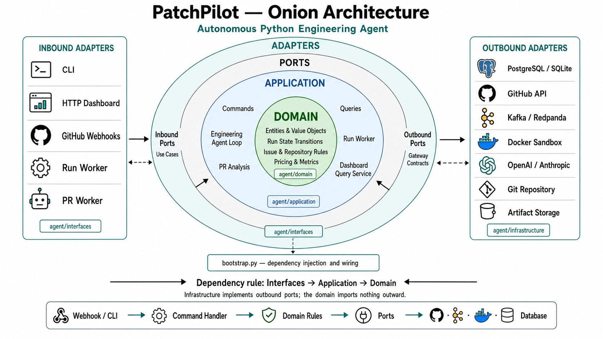

<p align="center">
  
</p>

<h1 align="center">PatchPilot</h1>

<p align="center">
  <strong>Autonomous Software Engineering Agent that fixes GitHub issues end-to-end</strong>
</p>

<p align="center">
  <a href="#features">Features</a> &bull;
  <a href="#architecture">Architecture</a> &bull;
  <a href="#how-it-works">How It Works</a> &bull;
  <a href="#tech-stack">Tech Stack</a> &bull;
  <a href="#quickstart">Quickstart</a> &bull;
  <a href="#deployment">Deployment</a> &bull;
  <a href="#testing">Testing</a>
</p>

---

PatchPilot takes a GitHub issue URL and autonomously: clones the repo, installs dependencies, runs tests in a Docker sandbox, sends failing context to an LLM, applies proposed code edits, re-runs tests, and iterates until they pass -- then commits to a new branch and optionally opens a draft PR. It also includes an async PR review pipeline powered by Kafka.

Built with **hexagonal (onion) architecture**, AST-enforced layer boundaries, and production-grade infrastructure including Docker sandboxing, Kafka event streaming, PostgreSQL persistence, and a full FastAPI dashboard.

## Features

### Autonomous Issue Fixing
- **End-to-end automation** -- from GitHub issue to passing tests and draft PR, zero human intervention required
- **Multi-provider LLM support** -- OpenAI (GPT-4.1, GPT-4o) and Anthropic (Claude Sonnet) with native tool calling
- **Iterative repair loop** -- up to N configurable iterations, feeding test output back to the LLM each round
- **Smart environment detection** -- auto-detects `pyproject.toml`, `requirements.txt`, `setup.py`, `Pipfile`, `poetry.lock` and derives install/test commands
- **Per-repo configuration** -- optional `agent.yaml` overrides for custom install, test commands, and sandbox limits

### Docker Sandboxing
- Every command runs inside an isolated Docker container with CPU/memory limits
- **Command allowlisting** -- only approved executables (`python`, `pytest`, `pip`, `make`, etc.)
- **Shell injection prevention** -- blocks `&&`, `||`, `;`, `|`, backticks, `$()`, redirects
- **Path traversal protection** -- rejects `..` and absolute paths outside the workspace
- Automatic container cleanup and timeout enforcement
- Docker-in-Docker support for containerized deployments

### LLM Tool System
The agent provides 8 tools to the LLM during a fix attempt:

| Tool | Description |
|------|-------------|
| `list_files` | List tracked files via `git ls-files` |
| `read_file` | Read file contents (up to 80KB) |
| `write_file` | Create or overwrite a file |
| `search_text` | Ripgrep-powered pattern search with line numbers |
| `apply_patch` | Apply a unified git diff |
| `git_diff` | Show current uncommitted changes |
| `git_status` | Show working tree status |
| `run_command_in_sandbox` | Execute a command inside Docker |

### Async PR Review Pipeline
- GitHub webhooks trigger Kafka-backed analysis workers
- HMAC-SHA256 webhook signature validation
- Workers fetch PR metadata, generate structured Markdown reviews, and post comments
- Commit status updates (pending -> success) with links to the analysis
- API and PR workers scale independently; offsets committed only after success

### Operations Dashboard (FastAPI)
- **Public landing page** with product overview
- **Authenticated workspace** with GitHub OAuth or username/password login
- **Run management** -- submit, monitor, and inspect agent runs
- **Run detail view** -- tool calls, test results, patch diffs, cost estimates
- **REST API** -- `/api/runs`, `/api/stats`, `/api/audit-events`, `/api/artifacts`
- **Health & readiness probes** for load balancers and Kubernetes
- 12-hour session TTL with signed HTTP-only cookies

### Cost Tracking & Pricing
- Per-run token usage tracking (input/output tokens from provider APIs)
- Configurable price tables with env-var overrides (`AGENT_MODEL_PRICES_JSON`)
- Estimated cost displayed in CLI output and dashboard
- Default prices for GPT-4.1, GPT-4o, Claude Sonnet models

### Security
- API keys and tokens redacted from all logged output via `EnvironmentSecretRedactor`
- Webhook payloads validated with HMAC-SHA256
- Production preflight (`agent doctor`) fails closed on unsafe configurations
- No branch push or PR creation without explicit opt-in

## Architecture

PatchPilot follows **hexagonal (onion) architecture** with strict dependency rules enforced by AST-based architecture tests at CI time.

```
                    ┌─────────────────────────────────────────┐
                    │            INBOUND ADAPTERS             │
                    │   CLI  ·  HTTP Dashboard  ·  Webhooks   │
                    │        Run Worker  ·  PR Worker          │
                    └────────────────┬────────────────────────┘
                                     │ calls
                    ┌────────────────▼────────────────────────┐
                    │             APPLICATION                  │
                    │   Command Handlers  ·  Query Services    │
                    │     Use Cases  ·  Outbound Port Contracts│
                    └────────────────┬────────────────────────┘
                                     │ depends on
                    ┌────────────────▼────────────────────────┐
                    │               DOMAIN                     │
                    │  Entities  ·  Value Objects  ·  Enums    │
                    │  State Machine  ·  Pricing  ·  Metrics   │
                    │         (zero framework imports)         │
                    └─────────────────────────────────────────┘
                                     ▲ implements
                    ┌────────────────┴────────────────────────┐
                    │           OUTBOUND ADAPTERS              │
                    │  PostgreSQL/SQLite  ·  GitHub API        │
                    │  Kafka  ·  Docker Sandbox  ·  LLM APIs  │
                    │  Artifact Storage  ·  Secret Redactor    │
                    └─────────────────────────────────────────┘
```

**Dependency rule:** `Interfaces -> Application -> Domain`. Infrastructure implements outbound ports; the domain imports nothing outward.

### Key Architectural Decisions

| Decision | Rationale |
|----------|-----------|
| **Onion / hexagonal architecture** | Clean separation of business logic from infrastructure; swap databases, LLM providers, or message brokers without touching domain code |
| **AST-enforced layer boundaries** | `test_architecture.py` walks every `.py` file with Python's `ast` module and asserts no forbidden cross-layer imports -- architecture compliance is a CI gate, not a convention |
| **Composition root (`bootstrap.py`)** | Single file wires all concrete adapters to ports -- no module outside bootstrap knows which database or LLM provider is active |
| **Native LLM tool calling** | Uses OpenAI and Anthropic's built-in tool/function calling APIs instead of string parsing -- structured, reliable, provider-native |
| **Kafka for PR pipeline** | Decouples webhook ingestion from analysis execution; workers scale horizontally; offset-based delivery guarantees |
| **Docker sandbox per command** | Every install/test command runs in an isolated container -- defense in depth against arbitrary code from untrusted repos |

### Project Structure

```
autonomous_engineering_agent/
├── agent/
│   ├── domain/              # Pure business logic (zero external imports)
│   │   ├── entities.py      # Run, Issue, TestResult dataclasses
│   │   ├── value_objects.py  # IssueRef, BranchName, RunStatus enums
│   │   ├── pricing.py       # Cost calculation formulas
│   │   └── ...
│   ├── application/         # Use cases & command/query handlers
│   │   ├── commands/        # QueueRun, ExecuteRun, EnqueuePRAnalysis
│   │   ├── queries/         # DashboardQueryService
│   │   └── ports/           # Outbound port interfaces (protocols)
│   ├── infrastructure/      # Concrete adapter implementations
│   │   ├── llm/             # OpenAI & Anthropic providers
│   │   ├── sandbox/         # Docker sandbox with allowlisting
│   │   ├── repository/      # Git workspace, tool executor
│   │   ├── persistence/     # PostgreSQL & SQLite repositories
│   │   ├── messaging/       # Kafka producer & consumer
│   │   ├── github/          # GitHub API client
│   │   └── config/          # Environment-based settings
│   ├── interfaces/          # Inbound adapters
│   │   ├── cli.py           # argparse CLI
│   │   ├── http/            # FastAPI dashboard & webhooks
│   │   └── workers/         # Run worker, PR worker
│   └── bootstrap.py         # Composition root (DI wiring)
├── tests/
│   ├── test_architecture.py # AST-enforced layer boundary tests
│   ├── test_sandbox.py      # Docker sandbox security tests
│   ├── test_executor_smoke.py
│   └── ...                  # 16 test modules
├── migrations/              # SQL schema migrations
├── evals/                   # Evaluation manifests
├── docker/                  # Sandbox Dockerfiles
├── docker-compose.yml       # Full local stack
├── Makefile                 # Development commands
└── pyproject.toml           # Project metadata & dependencies
```

## How It Works

```
GitHub Issue URL
       │
       ▼
┌──────────────┐     ┌──────────────┐     ┌──────────────┐
│  Fetch Issue │────▶│  Clone Repo  │────▶│  Detect Env  │
│  + Comments  │     │  + Branch    │     │  + Install   │
└──────────────┘     └──────────────┘     └──────┬───────┘
                                                  │
       ┌──────────────────────────────────────────┘
       ▼
┌──────────────┐     ┌──────────────┐     ┌──────────────┐
│  Build LLM   │────▶│  LLM Proposes│────▶│  Apply Edits │
│  Prompt      │     │  Fix (Tools) │     │  to Codebase │
└──────────────┘     └──────────────┘     └──────┬───────┘
                                                  │
       ┌──────────────────────────────────────────┘
       ▼
┌──────────────┐     ┌──────────────┐     ┌──────────────┐
│  Run Tests   │────▶│  Tests Pass? │─NO─▶│  Next        │
│  in Docker   │     │              │     │  Iteration   │──┐
└──────────────┘     └──────┬───────┘     └──────────────┘  │
                        YES │                                │
                            ▼                     ◄──────────┘
                     ┌──────────────┐
                     │  Commit +    │
                     │  Open PR     │
                     └──────────────┘
```

1. **Parse** -- accepts `https://github.com/owner/repo/issues/123`, `owner/repo#123`, or `"owner/repo 123"`
2. **Fetch** -- retrieves issue title, body, labels, comments, and linked PRs via GitHub API
3. **Clone** -- creates a fresh clone with token-authenticated HTTPS, checks out `agent/fix-issue-{N}-{timestamp}`
4. **Detect** -- identifies Python project type and derives install/test commands (overridable via `agent.yaml`)
5. **Setup** -- runs install commands inside Docker sandbox; fails fast on setup errors
6. **Iterate** -- builds a prompt with issue context, relevant source files, git status/diff, and last test output; calls the LLM with tool access; applies proposed changes; runs tests. Repeats until tests pass or max iterations exhausted
7. **Ship** -- commits passing changes, optionally pushes branch and opens a draft PR
8. **Log** -- writes a full replayable JSON artifact with all commands, tool calls, patches, test results, and cost metrics

## Tech Stack

| Layer | Technology |
|-------|------------|
| **Language** | Python 3.11+ |
| **Web Framework** | FastAPI + Uvicorn |
| **LLM Providers** | OpenAI SDK, Anthropic SDK (native tool calling) |
| **Database** | PostgreSQL 16 (production) / SQLite (development) |
| **Message Broker** | Apache Kafka / Redpanda |
| **Containerization** | Docker (sandbox execution + deployment) |
| **GitHub Integration** | PyGithub + REST API v2022-11-28 |
| **Code Search** | ripgrep |
| **Infrastructure** | Docker Compose, Kubernetes, Terraform |
| **Reverse Proxy** | Caddy (automatic HTTPS) |
| **Linter** | Ruff |
| **Type Checker** | mypy |
| **Tests** | pytest (16 test modules) |

## Quickstart

### Prerequisites

- Python 3.11+
- Docker (for sandbox execution)
- A GitHub personal access token
- An OpenAI or Anthropic API key

### Local CLI

```bash
# Clone the repository
git clone https://github.com/sualharun/PatchPilot.git
cd PatchPilot/autonomous_engineering_agent

# Install in development mode
pip install -e .

# Configure environment
cp .env.example .env
# Edit .env with your GITHUB_TOKEN and OPENAI_API_KEY or ANTHROPIC_API_KEY

# Run preflight checks
agent doctor

# Fix an issue
agent run --issue https://github.com/owner/repo/issues/42 --model gpt-4.1
```

### Full Stack (Docker Compose)

```bash
cd autonomous_engineering_agent

# Configure environment
cp .env.example .env
# Edit .env with your credentials

# Start everything: PostgreSQL, Redpanda, Dashboard, Workers
docker compose up --build

# Dashboard available at http://localhost:8080
```

This starts:
- **PostgreSQL 16** -- persistent run storage
- **Redpanda** -- Kafka-compatible message broker for PR analysis
- **Dashboard** -- FastAPI web UI on port 8080
- **Run Worker** -- polls for queued issue-fixing jobs
- **PR Worker** -- consumes Kafka PR analysis events

### Run an Evaluation

```bash
agent eval --manifest evals/example.yaml
# Writes eval-report.json with solve rate and per-task results
```

## Deployment

| Option | Command | Cost |
|--------|---------|------|
| **Local CLI** | `pip install -e . && agent run ...` | Free (+ LLM API costs) |
| **Docker Compose** | `docker compose up --build` | Free (local) |
| **Single VPS** | `./scripts/vps-deploy.sh` | ~$15-40/month |
| **Kubernetes** | `kubectl apply -k deploy/kubernetes/` | Varies |
| **Terraform** | `cd infra/terraform && terraform apply` | Varies |

PR analysis workers scale independently:
```bash
kubectl scale deployment/patchpilot-pr-worker --replicas=3
```

## Testing

```bash
# Run all tests
python3 -m pytest

# Run with coverage
python3 -m pytest --cov=agent

# Lint
python3 -m ruff check .

# Type check
mypy

# All checks
make check
```

### Architecture Tests

The most distinctive part of the test suite -- `test_architecture.py` uses Python's `ast` module to walk every `.py` file in each layer and asserts **no forbidden cross-layer imports exist**:

- **Domain** must not import application, infrastructure, interfaces, FastAPI, requests, psycopg, sqlite3, subprocess, or dotenv
- **Application** must not import infrastructure, interfaces, FastAPI, requests, psycopg, sqlite3, subprocess, or kafka
- **Infrastructure** must not import interfaces
- **HTTP routes** must not reference `RunStore` directly

Architecture compliance is a CI gate, not a convention.

## Configuration

All configuration is via environment variables (see `.env.example` for the full list):

| Variable | Description |
|----------|-------------|
| `GITHUB_TOKEN` | GitHub PAT for repo access |
| `OPENAI_API_KEY` | OpenAI API key |
| `ANTHROPIC_API_KEY` | Anthropic API key |
| `DATABASE_URL` | PostgreSQL connection string |
| `KAFKA_BOOTSTRAP_SERVERS` | Kafka/Redpanda broker address |
| `AGENT_DOCKER_IMAGE` | Docker image for sandbox (default: `python:3.11-slim`) |
| `DASHBOARD_AUTH_ENABLED` | Enable dashboard authentication |
| `PATCHPILOT_PRODUCTION` | Enable production safety checks |

## License

MIT

---

<p align="center">
  Built by <a href="https://github.com/sualharun">@sualharun</a>
</p>
